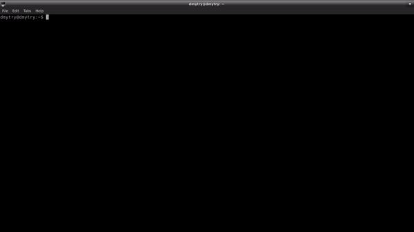

# wTesting [](https://travis-ci.org/Wandalen/wTesting)

Framework for convenient unit testing. Utility Testing provides the intuitive interface, simple tests structure, asynchronous code handling mechanism, colorful report, verbosity control and more. Use the module to get free of routines which can be automated.

### Installation

To install :

```
npm install -g wTesting
```

### Test files

Once installed, it's possible to run an existing test suites. The test suite is the highest structural unit of testing, it is a set of test routines and test data for testing a test object. Each test suite contains in a separate test file. Name of test file has the suffix `.test` so that the testing utility could find and run it. More details about writing test files in tutorial ['Hello World'](./doc/version.eng/tutorial/HelloWorld.md).

Try ready examples in `sample` directory. Clone repository by command `git clone https://github.com/Wandalen/wTesting.git` and go to the directory with test suite. For example, `cd ./sample/HelloWorld`. Before running test suite install dependencies by command `npm i`.

### Running tests

The utility provides simple and intuitive command line interface for running tests.

To get help about commands enter `tst .`, to get complete help use `tst .help`



To run test suite by utility, provide path to test file `tst .run ./path/to/test/suite`

<!-- gif image with test report -->

or it can runs directly by NodeJS `node ./path/to/test/suite`.

### Running options

Utility provides more control of testing process by running options. It is control parameters of the testing that is passed to the run command. Run options are performed for each test suite.

Examples of using running options

- verbosity - change amount of output test information. Accepts a value from 0 to 9. Default value is 4.

<!-- gif image with test report -->

- routine - used to test separate test routine. Accepts name of test routine.

<!-- gif image with test report -->

### Cheat sheet

All information about utility in short form given in [cheat sheet](./doc/version.eng/tutorial/TestingCheatSheet.pdf).

<!-- Test suit is a set of test routines in one file, each test routine is a set of test features( cases ).
Test feature is a combination of code execution and validation of obtained results, that is aimed to check some aspect of the program.

For convenience, each test feature may have own description, it can be provided through `description` field.

To get access to functionality of test package from test routine user must use first provided argument. -->
  <!--
#### Assertions

Assertions are routines that are used in test routine to validate results of code execution.

List of mostly used assertions:

* identical - checks if two arguments are equal;
* shouldBe - checks if result of provided expression is true;
* shouldThrowError - checks if code execution throws an error;
* mustNotThrowError - checks if code execution ends without error.

<!-- #### Launch options

* verbosity - level of detail of information in the output;
* routine - name of test routine to run, other routines are ignored.

#### How to run

Locally expects path to file that contains test suit:

```
node path/to/suit
```

Globally expects path to folder that contains many test suits( files ), but also can work with single suit:

```
wtest path/to/folder/with/suits
```

With options:

```
node path/to/suit verbosity:5 routine:myTest
```

### Example

```javascript
function myTest( test )
{  
  /* describe what is going to happen */
  test.description = 'info about test feature';

  /* do it and save results */
  var got = 'abc'.indexOf( 'a' );
  var expected = 0;

  /* compare result with expected */
  test.identical( got, expected );
}

/*
Map that describes test suit, contains
- name of the suit,
- map of test routines
- and other options
*/

var testSuite =
{
  name : 'name of my test suit',
  tests :
  {
      myTest : myTest
  }
}

/* Initilize test suit */
testSuite = wTestSuit( testSuite );

/* Run all tests of the suit */
wTools.Testing.test( testSuite );

``` -->
