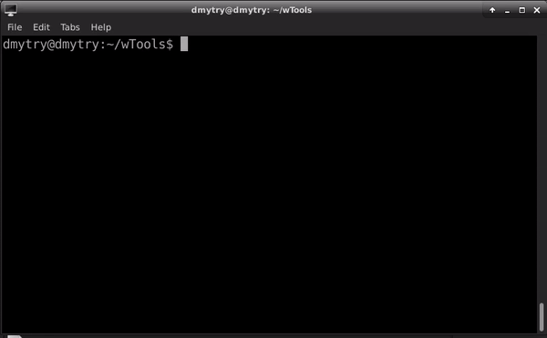

# utility::Testing  [](https://github.com/Wandalen/wTesting/actions/workflows/VisualPublish.yml) [](https://github.com/emersion/stability-badges#stable)

Framework for convenient unit testing. Utility Testing provides the intuitive interface, simple tests structure, asynchronous code handling mechanism, colorful report, verbosity control and more. Use the module to get free of routines which can be automated.

<div align="center">
  
</div>

### Why wTesting?

- Simple test syntax
- Simple grouping of test cases
- Running of group of test suites and running of separate test suite
- Testing of separate routines
- Colorful report
- Verbosity control
- Enhanced test checks messages
- Displaying code of test case in report
- Async function support
- Abstract test suites
- Runs tests concurrently

### Installation

To install :

```
npm install -g wTesting@stable
```

### Test files

Name of test file should has the suffix `.test` so that the testing utility could find and run it. Create a test file `First.test.js` in any project directory

```js
require( 'wTesting' );

function myTest( test )
{
  /* describe what is going to happen */
  test.case = 'info about test case';

  /* do it and save results */
  var got = 'abc'.indexOf( 'a' );
  var expected = 0;

  /* compare result with expected */
  test.identical( got, expected );
}

/*
Map that describes test suit, contains
- name of the suit,
- map of test routines
- and other options
*/

var testSuite =
{
  name : 'name of my test suit',
  tests :
  {
      myTest : myTest
  }
}

/* Initilize test suit */
testSuite = wTestSuite( testSuite );

/* Run all tests of the suit */
wTester.test( testSuite.name );
```

### Running tests

```
tst .run ./someDirectory
```
Running all test suites in directory by utility `Testing`. To run file `First.test.js` run command `tst .run ./` in directory of file.

```
tst .run ./path/to/suite
```
Running of separate test suite by utility `Testing`.

```
node ./path/to/suite
```

Running of separate test suite by NodeJS directly.

### Running options

Utility provides more control of testing process by running options. It is control parameters of the testing that is passed to the run command.

```
tst .run ./someDirectory verbosity:5
```

Option `verbosity` - change amount of output test information. Accepts a value from 0 to 9. Default value is 4.

```
tst .run ./path/to/suite routine:someRoutine
```

Option `routine` - used to test separate test routine. Accepts name of test routine.

```
tst .run ./someDirectory testRoutineTimeOut:10000
```

Option `testRoutineTimeOut` - limits the testing time for test routines. Accepts time in milliseconds. Default value is 5000ms.

### Documentation

Please see documentation in the `doc` directory.

For gentle introduction use [tutorials](./doc/version.eng/README.md#Tutorials). For getting exhaustive information on one or another aspect use [list of concepts](./doc/version.eng/README.md#Concepts) to find a concept of interest and get familiar with it.

### Cheat sheet

All information about utility in short form given in [cheat sheet](./doc/version.eng/tutorial/TestingCheatSheet.pdf).

### Quick references

- [Get help on commands of CLI](./doc/version.eng/tutorial/Help.md)
- [Running tests](./doc/version.eng/tutorial/Running.md)
- [Running options](./doc/version.eng/tutorial/Help.md#test-run-options-and-suite-options)
- [Writing tests](./doc/version.eng/tutorial/HelloWorld.md)
- [Grouping of tests cases](./doc/version.eng/tutorial/Report.md)
- [Test checks](./doc/version.eng/concept/TestCheck.md)

