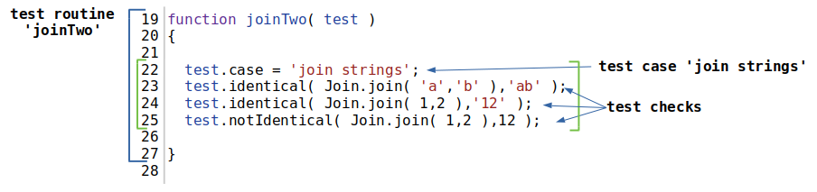

## Test check

Test check is a developer's expectation regarding the behavior of the test unit. Test check is expressed by some condition. It is the smallest structural unit of testing.

Most test checks accept two arguments and compare them to give a positive or negative test result:

- received data;
- expected data.

[Test case](TestCase.md) contains one or more test checks. One test check with the result of `failed` is enough for the utility to consider that the entire test unit did not pass it.

### An example of test case with test checks



The figure shows a test case `join strings` with three test checks. Each of the test checks compares two values. The first one is received using the `join` method, and the second is the expected value specified by the developer.

## Positive testing

It is a test to show the correct operation of the test unit under normal conditions without errors in the input data and in the normal state.

The next test checks can be applied for positive testing:
- `true`;
- `false`;
- `identical`;
- `notIdentical`;
- `equivalent`;
- `notEquivalent`;
- `contains`;
- `gt`;
- `ge`;
- `lt`;
- `le`;
- `mustNotThrowError`;
- `shouldReturnSingleResource`.

## Negative testing

It is a test to show the correct operation of a test unit in a false input or an erroneous state.

The next test checks can be applied for negative testing:
- `shouldThrowErrorSync`;
- `shouldThrowErrorAsync`;
- `shouldThrowErrorOfAnyKind`.

### The list of test checks

##### Test check `true`

Expects a single `bool-like` argument.

The check passes if the argument `true-like`, that is,` true` or the numeric value is nonzero.

The check fails if the argument is `false-like`, that is,` false` or the numeric value `0`.

It returns `true` if the test check is passed and` false` if the test check fails.

```js
var got = true;
test.true( got );
```

The `test.true` check will be passed as the `got` variable is `true` during the test.

##### Test check `false`

Expects a single `bool-like` argument.

The check passes if the argument `false-like`, that is,` false` or the numeric value is zero.

The check fails if the argument is `true-like`, that is,` true` or the numeric value is nonzero.

```js
var got = false;
test.false( got );
```

The `test.false` check will be passed as the `got` variable is `false` during the test.

##### Test check `identical`

In addition to the full form, it has a shortened - `il`.

Two arguments of any type are expected.

The check passes if the passed arguments are completely identical.

The check fails if the values of the arguments are different. The numerical deviation is not allowed.

```js
var got = { a : 'ok' };
var expected = { a : 'ok' };
test.identical( got, expected );
```

The `test.identical` check will be passed as the values of arguments are identical.

##### Test check `notIdentical`

In addition to the full form, it has a shortened - `ni`.

Two arguments of any type are expected.

The check passes if the passed arguments are different.

The check fails if the values of the arguments are completely identical. The numerical deviation is not allowed.

```js
var got = { a : 'ok' };
var expected = { a : 'ok' };
test.notIdentical( got, expected );
```

The `test.notIdentical` check will fail as the values of both arguments are identical during the test.

```js
var got = 1;
var expected = 1 + 1e-10;
test.notIdentical( got, expected );
```

The `test.notIdentical` check will be passed as the first value differs from the second to` 1e-10`.

##### Test check `equivalent`

In addition to the full form, it has a shortened - `et`.

Two arguments of any type are expected.

The check passes if the arguments are similar.

The test fails if the values of the arguments are not similar enough. A numeric deviation `eps` is allowed, it is specified in the testing options. Default numeric deviation is `1e-7`.

```js
var got = 1;
var expected = 1.00001;
test.equivalent( got, expected );
```

The `test.equivalent` check will fail as the default deviation is `1е-7`, and the values are different for `1е-5`.

```js
function somer( test )
{
  var got = 1;
  var expected = 1.00001;
  test.equivalent( got, expected );
}
somer.accuracy = 1e-4
```

The `test.equivalent` check will be passed as the numerical deviation in the test routine `somer` is set to `1е-4`.

```js
var got = true;
var expected = 1;
test.et( got, expected );
```

The `test.et` check will be passed as `got` and `expect` values are similar.

| got and expected values           | equivalent             | identical             |
|:----------------------------------|:-----------------------|:----------------------|
|  true, 1                          | pass                   | failed                |
|  false, 0                         | pass                   | failed                |
|  1, 1 + 1e-7                      | pass                   | failed                |
|  1, 1 - 1e-7                      | pass                   | failed                |

The table shows the differences between `equivalent` and `identical` checks.

##### Test check `notEquivalent`

In addition to the full form, it has a shortened - `ne`.

Two arguments of any type are expected.

The check passes if the arguments are not similar enough.

The test fails if the values of the arguments are similar. A numeric deviation `eps` is allowed, it is specified in the testing options. Default numeric deviation is `1e-7`.

```js
var got = 1;
var expected = 1.00001;
test.ne( got, expected );
```

The `test.ne` check will be passed as the default deviation is `1е-7` and the expected value from that obtained in “1е-5”.

| `got` and `expected` values           | `notEquivalent`             | `notIdentical`             |
|:--------------------------------------|:----------------------------|:---------------------------|
|  true, 1                              | failed                      | pass                       |
|  false, 0                             | failed                      | pass                       |
|  1, 1 + 1e-7                          | failed                      | pass                       |
|  1, 1 - 1e-7                          | failed                      | pass                       |

The table shows the differences between `equivalent` and `identical` checks.

##### Test check `contains`

Two arguments of any type are expected.

The check passes if the arguments are identical or the first argument contains the second argument. In the case when associative arrays are compared, then the first one must contain the key-value pair of the second. The numerical deviation is not allowed.

The test fails if the first argument is not completely contained in the second.

```js
var got = 13;
var expected = 13;
test.contains( got, expected );
```

The `test.contains` check will be passed as `got` and `expect` values are the same.

```js
var got = { a : 1, b : 2, c : 3 };
var expected = { a : 1 };
test.contains( got, expected );
```

The `test.contains` check will be passed as the associative array `got` contains `a : 1` element.

```js
var got = { a : 1, b : 2, c : 3 };
var expected = { d : 4 };
test.contains( got, expected );
```

The `test.contains` will fail as the associative array `got` contains not the element `d : 4`.

```js
var got = { a : 1, b : 2, c : 3 };
var expected = { a : 4 };
test.contains( got, expected );
```

The `test.contains` check will fail the associative array `got` contains not the element `a : 4`.

##### Test check `gt`

Expects two arguments of a numeric type or type that can coerce to such. If necessary, the coercing is carried out to the numerical type.

The check passes if the value of the first argument is greater than the value of the second.

The test fails if the value of the first argument is less than or equal to the value of the second.

```js
var a = true;
var b = 0;
test.gt( a, b )
```

The `test.gt` check will be passed as the value of `a` variable will be coerced to `1`, which is greater than `0`.

##### Test check `ge`

Expects two arguments of a numeric type or type that can coerce to such. If necessary, the coercing is carried out to the numerical type.

The check passes if the value of the first argument is greater than or equal to the value of the second.

The check fails if the value of the first argument is less than the value of the second.

```js
var a = true;
var b = 1;
test.ge( a, b )
```

The `test.ge` will be passed as the value of `a` variable will be coerced to `1`, and the values of both arguments will be equal.

##### Test check `lt`

Expects two arguments of a numeric type or type that can coerce to such. If necessary, the coercing is carried out to the numerical type.

The check passes if the value of the first argument is less than the second.

The check fails if the value of the first argument is greater than or equal to the second.

```js
var a = false;
var b = 1;
test.lt( a, b )
```

The `test.lt` check will be passed the value of `a` variable will be coerced to `0`, which is less than `1`.

##### Test check `le`

Expects two arguments of a numeric type or type that can coerce to such. If necessary, the coercing is carried out to the numerical type.

The check passes if the value of the first argument is less than or equal to the value of the second.

The check fails if the value of the first argument is greater than the value of the second.

```js
var a = false;
var b = 0;
test.le( a, b )
```

The `test.le` check will be passed as the value of `a` variable will be coerced to `0`, which is equal to value of `b`.

##### Test check `shouldThrowErrorSync`

Expects one argument in the form of a routine, which runs without arguments to test its work.

The check passes if the routine throws an error. The `shouldThrowErrorSync` check does not notice asynchronous errors.

The check fails if the routine does not throw an error.

```js
test.shouldThrowErrorOfAnyKind( function()
{
  throw 'err1';
});
```

The `test.shouldThrowErrorSync` check will be passed as the specified routine throws an error during the test.

##### Test check `shouldThrowErrorAsync`

Expects one argument in the form of a routine, which runs without arguments to test its work.

The check passes if the routine throws an error asynchronously, that is, through `consequence` or` promise`.  Asynchronous errors can be delayed from the moment the routine returns.

The check fails if the routine does not throw an error during the time it was tested.

```js
test.shouldThrowErrorAsync( function()
{
  return _.timeOut( 250, function()
  {
    throw _.err( 'test' );
  });
});
```

The `test.shouldThrowErrorAsync` check will be passed as the specified routine throws asynchronous error. The routine `timeOut` returns consequence with `_.err( 'test' )` error.

##### Test check `shouldThrowErrorOfAnyKind`

Expects one argument in the form of a routine, which runs without arguments to test its work.

The check passes if the routine throws an error synchronously or asynchronously, that is, through `consequence` or` promise`.  Asynchronous errors can be delayed from the moment the routine returns.

The test fails if the routine does not throws neither synchronous nor an asynchronous error during the time it is tested.

```js
test.shouldThrowErrorOfAnyKind( function r1()
{
  throw 'err1';
});
```

The `test.shouldThrowErrorOfAnyKind` check will be passed as the routine `r1` throws the error `throw 'err1'` synchronously.

```js
test.shouldThrowErrorOfAnyKind( function r2()
{
  return _.timeOut( 250, function()
  {
    throw _.err( 'test' );
  });
});
```

The `test.shouldThrowErrorOfAnyKind` will be passed as the routine `r2` throws the error `throw _.err( 'test' )` asynchronously, it throws the error through `250ms` after run.

##### Test check `mustNotThrowError`

Expects one argument in the form of a routine, which runs without arguments to test its work.

The check passes if the routine does not throw an error synchronously or asynchronously.

The check fails if the routine throws the error synchronously or asynchronously. After such an error, the routine can continue execution because it will be isolated in the subroutine.

```js
test.shouldThrowErrorOfAnyKind( function r1()
{
  return 'value';
});
```

The `test.mustNotThrowError` check will be passed as the synchronous routine `r1` does not throw an error.

```js
test.shouldThrowErrorOfAnyKind( function r1()
{
  return _.timeOut( 250, function()
  {
    return 'value`;
  });
});
```

The `test.mustNotThrowError` check will be passed as the asynchronous routine `r2` does not throw an error.

##### Test check `shouldReturnSingleResource`

Expects one argument in the form of a routine, which runs without arguments to test its work.

The check passes if the routine ends synchronously or the consequence returns only one resource.

The check fails if its consequence receives several messages.

```js
test.shouldReturnSingleResource( function r()
{
  var con = new _.Consequence();
  con.take( 1 );
  con.take( 2 );
  return con;
});
```

The `test.shouldReturnSingleResource` check will fail as the routine `r` returns consequence with two messages - `1` and `2`.

[Back to content](../README.md#Concepts)
