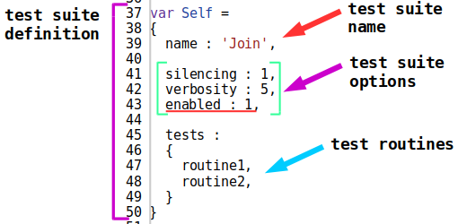
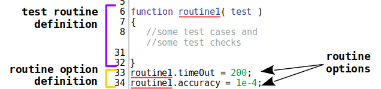

# Run option

The control parameter of the testing that is passed to the run command. Run options are performed for each test suite.

The run option is specified after the utility command. For example, in the command

```
tst .imply accuracy:1e-4 .run path/to/dir
```

the `accuracy` option is specified, it sets the allowable numeric deviation. The specified option applies to each test suite in the `path/to/dir` directory.

Run options override test suite options. If the same option in the command and in the test code is used, then the command has a higher priority.

The command can use several run options at the same time. For example, a command with `verbosity` and` silencing` options can look like this:

```
tst .imply verbosity:6 silencing:1 .run path/to/dir
```

You can learn more about the list of run options by going to [tutorial](../tutorial/Help.md#Options-launch-and-options-suites).

# Test suite option

The control parameter of the testing that is specified in the test suite definition. These options override the default values, and it can be overridden by the run options.

The input format of run options and test suite options is the same. The test suite options have a lower priority than the startup options. Therefore, if the test suite and the entered command have the same option, the utility uses the run option and ignores the test suite options.



The figure shows the part of the code with the test suite definition. After the name of the test suite, test options are indicated.

The test suite has three options: `silencing`,` verbosity` and `enabled`. If the same options are not specified in the test command, the test report will have a verbosity value `5`, and the report will not contain the output of the test unit. When the `silencing` i` verbosity` option is specified in the command, the utility uses the value specified in the command. For example, when using the command

```
tst .imply verbosity:3 .run path/to/dir 
```

the utility displays a report with a verbosity level `3`.

Some options are only used in the test suites. For example, the option `enabled` (underlined by red) is intended to disable the test suite from the testing. The option has two values: `0` and` 1`. `0` - the test suite is not executed, `1` - the test suite is executed. Default value is `1`.

# Test routine option

The control parameter of the testing that is specified in a separate test routine.

Test routine options are used to more precisely configuration of the testing process.

If the test routine does not have explicitly specified test options, then it uses the default options. The default routine options can be overridden with the test suite options or run options.

Explicitly specified test routine options have a higher priority than the test suite option and run options. If the test routine options are explicitly specified, it can be changed only by correcting the test suite file.



The figure shows the test routine `routine1`. After the test routine is defined in lines 6-32, the test routine options `timeOut` and` accuracy` are specified in lines 33-34. The test routine option is set by assigning values to the fields of the test routine `routine1`.

In the routine, the `timeOut` option has the value of 60000 ms, that is, the developer allocates one minute of time for it.

The routine time out can be changed for all routines using the `routineTimeOut` run option or a similar test suite option. But in this case, the option changes the time out for all routines for which `timeOut` option is not specified. To configure the routine, set the test routine options.

The possible use of the command with the `accuracy` or `routineTimeOut` option will not affect the performance of the test routine `routine1`, as the routine options have a higher priority.

[Back to content](../README.md#Concepts)
