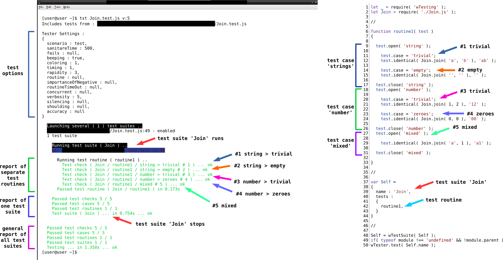
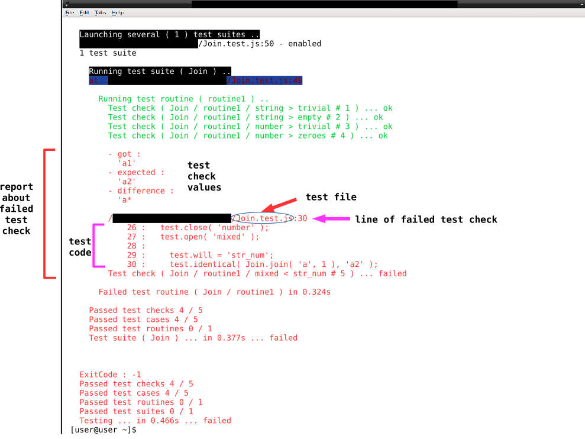

## How to read a report and group test checks

How to read a test report and group the test checks in groups and test case. How the test suite content is displayed in the report.

### Test unit

<details>
    <summary><u>Code of file <code>Join.js</code></u></summary>

```js
module.exports.join = function( a, b )
{
  return String( a ) + String( b );
}

```

</details>

Enter the code above into the `Join.js` file.

The `join` function concatenates two strings. It is exported for use.

### Test file

The suite `Join.test.js` has the suffix` .test` so that the testing utility could find it.

<details>
    <summary><u>Code of file <code>Join.test.js</code></u></summary>

```js
let _ = require( 'wTesting' );
let Join = require( './Join.js' );

//

function routine1( test )
{
  test.open( 'string' );

    test.case = 'trivial';
    test.identical( Join.join( 'a', 'b' ), 'ab' );

    test.case = 'empty';
    test.identical( Join.join( '', '' ), '' );

  test.close( 'string' );
  test.open( 'number' );

    test.case = 'trivial';
    test.identical( Join.join( 1, 3 ), '13' );

    test.case = 'zeroes';
    test.identical( Join.join( 0, 0 ), '00' );

  test.close( 'number' );
  test.open( 'mixed' );

    test.identical( Join.join( 'a', 1 ), 'a1' );

  test.close( 'mixed' );
}

//

var Self =
{
  name : 'Join',
  tests :
  {
    routine1,
  }
}

//

Self = wTestSuite( Self );
if( typeof module !== 'undefined' && !module.parent )
wTester.test( Self.name );

```

</details>

Enter the code above into `Join.test.js` file.

The test routine `routine1` has 2 test groups that named `string` and `number`, as well as a test case `mixed` with one test check. The `string` group contains 2 test cases -` trivial` and `empty`, each of which has one check. The `number` group has test cases `trivial` and `zeroes`, each of which has one test check. The groups were formed by the type of arguments passed to the `Join.join` function that is being tested. In the test checks of the `string` group string values are used, the `number` group - numeric values, and in the test case `mixed` string and numeric values are used.

### How to read a report of testing

There is a correspondence between the structure of the test file and the output of the test results.

Install the dependency `Testing` and run the test in the `Join.test.js` file by entering the command

```
tst Join.test.js verbosity:5
```

The `verbosity` option sets the amount of output information. Learn more about this option in the tutorial [control of verbosity](Verbosity.md).

##### Correspondence between the console report and the contents of `Join.test.js` file



The figure on the left side shows the console output after the command has been executed. It is divided into four main sections and contains several additional service messages.

The first section is the testing options. It is intended to display current testing parameters. In the fourth line from the bottom of the section, you can find the `verbosity` option with the value `5`. This value was set in the option of the entered command.

The second section is a test report for a separate test routine.  When testing of a test suites group is performed, each test suite has such a section.

The number of test routines, test cases, and test checks is determined by the test suite code. The figure on the right shows the code of `Join.test.js` file. The report includes the results of performing five test cases in the test routine `routine1`. Two groups have been created from the given test cases - `string` and` number`. In order to merge the test cases into a group, the routines [`open()` and `close()`](../concept/TestCase.md) are used.

If nesting is used, the line of the report of the passed test case looks like:

```
Test check ( Join / routine1 / string > trivial # 1) ... ok

```

This line indicates that the test has passed, it has the number 1. The string in the parenthesis indicates the path to test check: test suite `Join` / routine `routine1` / group of test cases `string` > test case `trivial`. Accordingly, the `>` symbol is used to denote the nesting of the test case.

The utility makes a conclusion regarding the passed test checks in the routine: `Passed test routine ( Join / routine1 ) in 0,173s`.

The third section is the final report for one test suite. When testing of test suites group is performed, a separate test report is displayed as soon as the test is completed. The section gives a general summary - the number of passed checks, test cases, test routines, and utility makes a conclusion regarding it.

In this test suite, 5 test check passed in the 5 test cases, and one test routine was done. Conclusion on the suite `Join` - passed.

The fourth section is the general test report. The report also includes the number of passed test checks, test cases, test routines, and test suites. When testing of test suites group is performed, the relevant information is summarized.

The directory has only one test suite, so the total result includes information from the previous section only.

### The report with failed check

The report may contain failed test checks that indicate program code errors or errors in the code of test suite.

<details>
    <summary><u>Code of file <code>Join.test.js</code> with an error in test check</u></summary>

```js
let _ = require( 'wTesting' );
let Join = require( './Join.js' );

//

function routine1( test )
{
  test.open( 'string' );

    test.case = 'trivial';
    test.identical( Join.join( 'a', 'b' ), 'ab' );

    test.case = 'empty';
    test.identical( Join.join( '', '' ), '' );

  test.close( 'string' );
  test.open( 'number' );

    test.case = 'trivial';
    test.identical( Join.join( 1, 3 ), '13' );

    test.case = 'zeroes';
    test.identical( Join.join( 0, 0 ), '00' );

  test.close( 'number' );
  test.open( 'mixed' );

    test.will = 'str_num';
    test.identical( Join.join( 'a', 1 ), 'a2' );

  test.close( 'mixed' );
}

//

var Self =
{
  name : 'Join',
  tests :
  {
    routine1,
  }
}

//

Self = wTestSuite( Self );
if( typeof module !== 'undefined' && !module.parent )
wTester.test( Self.name );

```

</details>

Replace the content of the `Join.test.js` file with the code above.

In the file, the test case `mixed` has been changed, the line `test.will = 'str_num'` is added to it. This line represents the name of the test check. The expected value has the error, because in the `Join.join` routine passes the values `a` and `1`, but the test check expects the value `a2`.

To get the test report, enter `tst Join.test.js v:5`.

##### Test report for error in test check



Utility displays expanded error information.

The error report first states:
- received value `got`;
- expected value `expected`;
- the difference between the received and the expected value is `difference`.
The output shows that the expected and received values coincide in the `a` letter, but differ in the next characters -` 1` and `2`.

The next section shows the name of the file with the error, the number of line with failed test check, as well as the part of the test suite code with failed test check.

The result of the test check looks like `Test test ( Join / routine1 / mixed < str_num #5 ) ... failed`, it contains the name `str_num` specified in the code of test suite. The name of the test check and its number are separated by a `< ` symbol.

The result of test suite report and the overall test result are considered to be failed due to one failed check.

### Summary

- Test cases can be grouped, it is done by nesting test cases in the form `test.open()`, `test.close()`.
- The test report about passed test check contains the location of test check, its name and number.
- The console output of failed test checks can contain information about the difference in the expected and received values, and a part of test suite code with this test check.
- The test result will be `passed` if all tests were successful. Even after one failed test, the test result will be `failed`.
- By using the error information, the developer can immediately find the part of the code that was broken.

