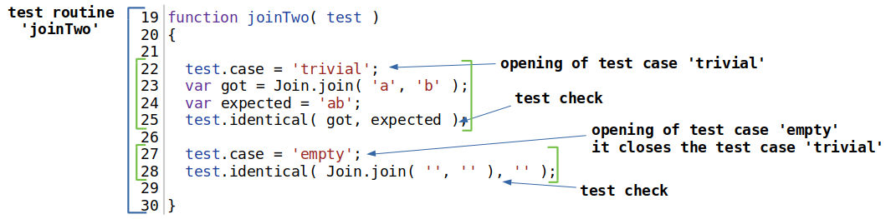
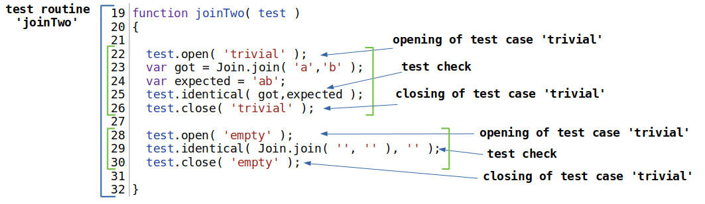
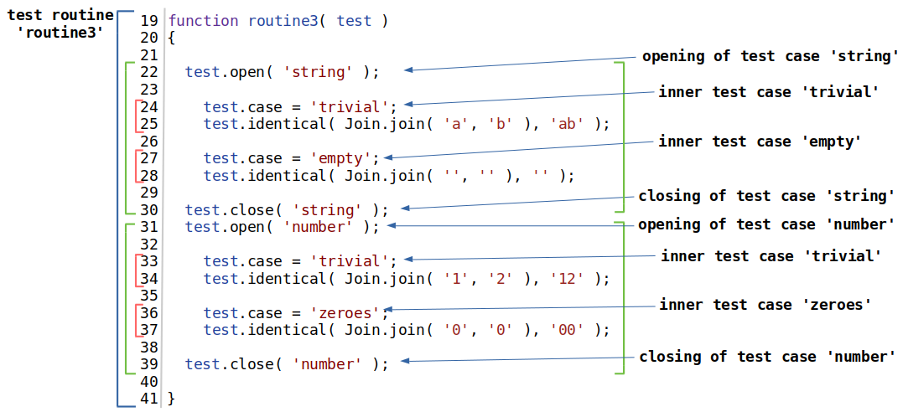

## Тест кейс

Тест кейс або група тест перевірок - це одна або декілька тест перевірок із супровідним кодом поєднаних в логічну структурну одиницю для перевірки функціональності якогось аспекту об'єкту, що тестується.

### Визначення через `test.case`

Застосовуйте поле `test.case` для визначення тест кейсів.

Тест рутина `routine1` має тест кейси `trivial` i `empty`. Визначення тест кейсу відбувається присвоєнням рядкового значення полю `case`. Початок наступного тест кейсу закриває попередній - тест кейс `empty`, котрий відкрито в 27 рядку, закрив тест кейс `trivial`.

### Визначення через `test.open()`, `test.close()`

Застосовуйте рутини `test.open()`, `test.close()` для групування перевірок.

Тест рутина `routine2` має таку ж структуру, як із тест рутина `routine1`. Вона має тест кейси `trivial` i `empty`. Для того, щоб задати тест кейс використовується рутина `test.open()`, якій а якості аргумента передається назва тест кейса. Закривається тест кейс рутиною `test.close()`. Рутина `test.close()` так само, як і рутина `test.open()` приймає назву тест кейсу.

Тестова рутина `routine3` має 2-ві групи перевірок `string` та `number`. Їх було так згруповано по типу аргументів, що передаються функції, що тестується `Join.join`. Групу `string` описано рядками 22-30, групу `number` описано рядками 31-39. Групу `string` містить 2-ва тест кейси `trivial` та `empty` в кожному із яких по одній перевірці. Група `number` має тест кейси `trivial` та `zeroes` із одною перевіркою в кожному. Звіт, що формується на основі такої структури тест рутини можна бачити в туторіалі про те [як читати звіт](Report.md).

Структура тест рутини може бути складною і мати безліч рівнів вкладеності<!-- en : nesting -->.

[Повернутись до змісту](../README.md#Концепції)
