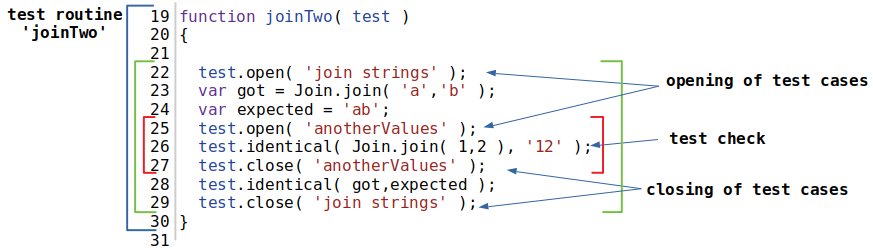

## Тест кейс

Тест кейс або група тест перевірок - це одна або декілька тест перевірок із супровідним кодом поєднаних в логічну структурну одиницю для перевірки функціональності якогось аспекту об'єкту, що тестується. 

### Визначення через `test.case`

На рисунку показано тест рутину `joinTwo` з тест кейсом `join strings`. Визначення назви тест кейсу проходить через присвоювання рядкового значення. Тест кейс `join strings` має одну тест перевірку.

### Визначення через `test.open()`, `test.close()`

На рисунку зображена тест рутина `joinTwo` зі зміненою формою визначення тест кейсу. Для того, щоб задати тест кейс використовується метод `open()` якому передається аргумент - назва тест кейсу. Щоб закрити тест кейс використовується метод `close()` якому потрібно передати назву тест кейсу, що потрібно закрити. З допомогою цієї форми запису можна вкласти один тест кейс в інший так же як тест кейс `anotherStrings` в `join strings`.
