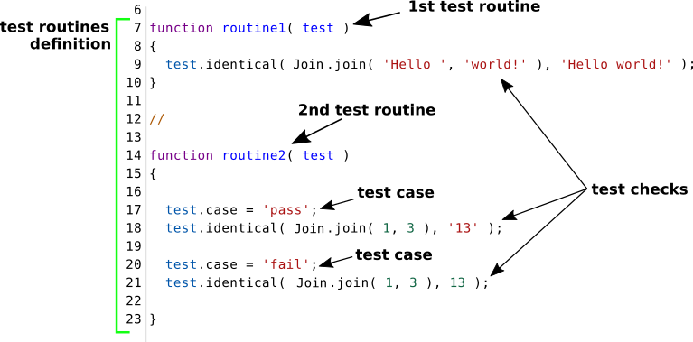

# Тест рутина

Тест рутина - рутина ( функція, метод ) розроблена для тестування, якогось із аспектів об'кту тестування. Тест сюіт розбивається на тест рутини, кожна із котрих виконується незалежно одна від одної. Інструкції тест рутини виконується послідовно та містять в собі тест перевірки, котрі можуть об'єднуватися в тест кейси та можуть мати опис.

Розбиття тест сюіта на тест рутини потрібно проводити з урахуванням того, що рутина припиняє своє виконання при першій же викинутій помилці.

### Результат виконання тест рутини

Тест рутина позначається, як провалена ( червоним ), якщо

- в ній виникла помилка;
- в ній не було здійснено жодної тест перевірки;
- принаймні одна тест перевірка дала негативний результат;
- час відведений на виконання тест рутини сплив.

Інкаше тест рутина позначається як пройдена ( зеленим ).

### Приклад тест рутин

На рисунку приведено секцію коду з двома визначеними тест рутинами. Перша рутина з назвою `routine1` виконує одну тест перевірку на ідентичність двох значень. Друга тест рутина з назвою `routine2` має два тест кейси, в кожному з яких є по одній тест перевірці. Окрім цього, друга тест рутина містить в своєму тілі опис тест кейсів. Для виконання тест рутин їх потрібно не забути згадати в визначенні тест сюіта.

[Повернутись до змісту](../README.md#Концепції)
