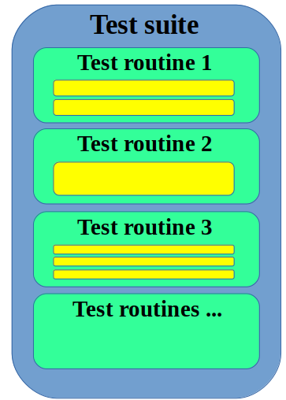

# Тест сюіт

Тест сюіт ( тестовий комлект, тестовий набір ) - це набір тест рутин, та тестових данних для тестування об'єкту тестування.

Тест сюіт міститься в окремо відведеному під нього файлі. Тест сюіт складається із:
- тест рутин
- тест опцій тестування

`Тест сюіт` може [наслідуватися](<Kos:лінк>) і бути наслідуваним.

На рисунку умовно зображено тест сюіт. Він об'єднує більш ніж три тест рутини, кожна з яких має власні структурні елементи. Кожна із тест рутин тест сюіта запускається по черзі від першої до останньої і тестує окрему частину програми.
