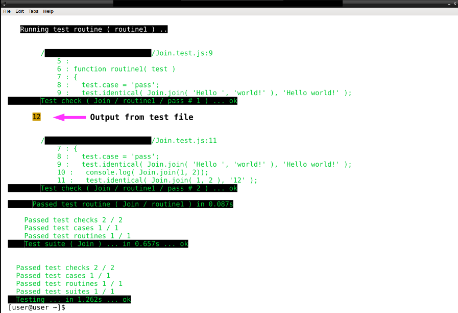

# Опція silencing

Фільтрування звіту тестування від сторонніх включень.

Дозволяє приховати власний вивід об'єкта, що тестується в консоль. Об'єкт тестування та код тест рутини може мати власний вивід. Цей вивід може погіршити читабельність звіту про тестування.

Опція запуску `silencing` має пріоритет над опцією тест сюіта.

Опція має два значення: 1 - ввімкнене, 0 - вимкнене. За замовчуванням - 0.

<details>
  <summary><u>Структура файлів</u></summary>

```
silencing
     ├── Join.js
     ├── Join.test.js
     └── package.json
```

</details>

Для дослідження опції `silencing` створіть структуру файлів в директорії `silencing` як приведено вище.

### Об'єкт тестування

<details>
    <summary><u>Код файла <code>Join.js</code></u></summary>

```js
module.exports.join = function( a, b )
{
  return String( a ) + String( b );
};
```

</details>

Функція `join` файла `Join.js`, виконує конкатенацію двох значень переданих значень.

### Тестовий файл

Для перевірки опції `silencing` потрібно, щоб об'єкт тестування, або тест файл мали вивід в консоль.

<details>
    <summary><u>Код файла <code>Join.test.js</code></u></summary>

```js
let _ = require( 'wTesting' );
let Join = require( './Join.js' );

//

function routine1( test )
{
  test.case = 'pass';
  test.identical( Join.join( 'Hello ', 'world!' ), 'Hello world!' );
  console.log( Join.join(1, 2) );
  test.identical( Join.join( 1, 2 ), '12' );
}

//

let Self =
{
  name : 'Join',
  silencing : 1,

  tests :
  {
    routine1,
  }
}

//

Self = wTestSuite( Self );
if( typeof module !== 'undefined' && !module.parent )
wTester.test( Self.name );
```

</details>

Внесіть в файл `Join.test.js` код, що представлений вище. В тест рутині додано рядок `console.log( Join.join(1, 2) )` для виводу результату об'єднання двох чисел, а в визначенні тест сюіта внесено опцію `silencing : 1`, котра вимикає вивід.

### Опція тест сюіта, опція запуску і вербальність виводу

Проведіть тестування в директорії, не використовуючи опції запуску. Для цього введіть команду

```
tst .run Join.test.js
```
Порівняйте вивід з приведеним.

<details>
  <summary><u>Вивід команди <code>tst .run Join.test.js</code></u></summary>

```
$ tst .run Join.test.js
Running test suite ( Join ) ..
    at  /path_to_module/testCreation/Join.test.js:40

      Passed test routine ( Join / routine1 ) in 0.059s

    Passed test checks 2 / 2
    Passed test cases 1 / 1
    Passed test routines 1 / 1
    Test suite ( Join ) ... in 0.657s ... ok


  Testing ... in 1.220s ... ok
```

</details>

Завдяки встановленій в тест сюіті опції, звіт не містить повідомлень в консоль. Всі перевірки пройдено успішно, загальний час тестування 1.220s.

<details>
  <summary><u>Вивід команди <code>tst .imply silencing:0 .run Join.test.js</code></u></summary>

```
$ tst .imply silencing:0 .run Join.test.js
Running test suite ( Join ) ..
    at  /path_to_module/testCreation/Join.test.js:40
12

      Passed test routine ( Join / routine1 ) in 0.056s

    Passed test checks 2 / 2
    Passed test cases 1 / 1
    Passed test routines 1 / 1
    Test suite ( Join ) ... in 0.643s ... ok


  Testing ... in 1.208s ... ok
```

</details>

Указання опції `silencing:0` змінить поведінку проходження тестування без зміни значення опції тест сюіта. Введіть команду `tst .imply silencing:0 .run Join.test.js` і порівняйте вивід.

Отриманий звіт містить рядок, а тест файл не змінився. Якщо повторити запуск тестування за замовчуванням, то вивід не міститиме зайвих включень.

Навіть при ввімкненій опції `silencing` звіт може містити вивід з об'єкту тестування або вивід з тест файла. Це можливо, якщо застосувується [опція `verbosity`](Verbosity.md).

<details>
  <summary><u>Вивід команди <code>tst .imply verbosity:7 silencing:0 .run Join.test.js</code></u></summary>



</details>

Введіть команду `tst .imply verbosity:7 silencing:0 .run Join.test.js`. Порівняйте з приведеним вище звітом.

На приведеному виводі показана частина звіту тестування. Стрілкою указано місце, де з'являється вивід з тест рутини `routine1`. Вказаний вивід маркується іншим кольором, щоб звіт було легше читати.

### Підсумок

- Опція `silencing` призначена для фільтрування звіту тестування від виводу об'єкта тестування або тестового файла.
- Опція запуску `silencing` має пріоритет над такою ж опцією тест сюіта.
- При поєднанні опції `silencing:1` і опції `verbosity` зі значенням від `7` і вище, в консолі з'являється вивід з об'єкта тестування і тест файла. Вивід маркується іншим кольором, щоб відрізнити його від звіту тестування.

[Повернутись до змісту](../README.md#tutorials)
