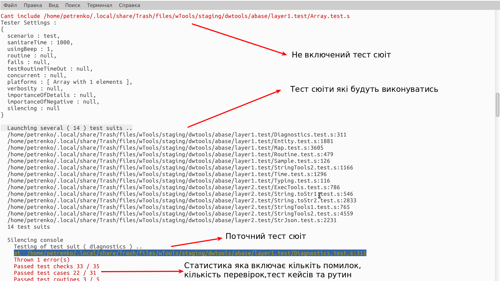
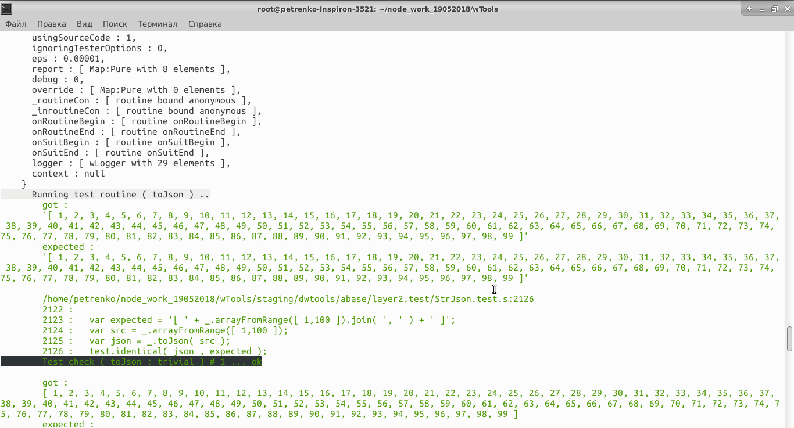
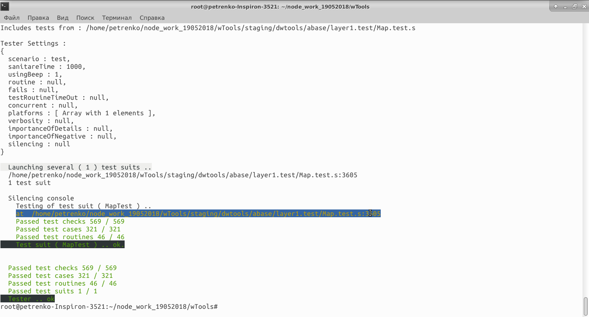
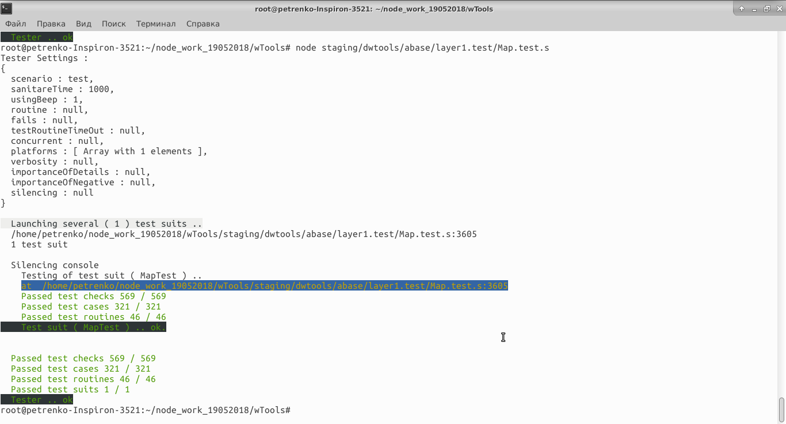
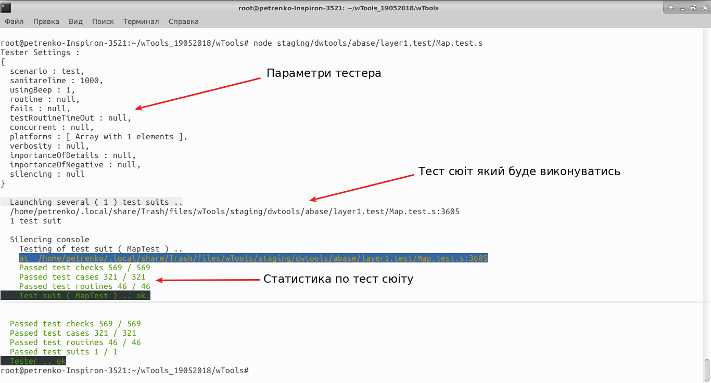

# Запуск тестів

Як запускати тест кейси, тест рутини, тест сюіти.

Існують три способа запуска тестів з наступними командами

|N п/п      | Спосіб запуску                                              | Команда                                              |
|:----------|:------------------------------------------------------------|:-----------------------------------------------------|
|[1](#1)    | Безпосередньо через npm                                     | `npm test`                                           |
|[2.1](#2.1)| Альтернативний спосіб запуску                               | `wtest proto`                                      |
|[2.2](#2.2)| Альтернативний спосіб запуску використовуючи файл тест сюіта| `wtest proto/dwtools/abase/layer1.test/Map.test.s` |
|[3](#3)    | Використовуючи файл тест сюіта                              | `node proto/dwtools/abase/layer1.test/Map.test.s`  | 

Экран терміналу вищовказаних команд в операційній системі Linux буде виглядати наступним образом:

Запуск теста безпосередньо через npm. Команда `npm test`.

Як можно побачити на скріншоті - було зроблено 13 помилок. Проскролив вікно консолі можно побачити - директорію з якої були виконані тест сюіти, та ті з них які не було включено до тестування, а також кількість пройдених тестів та помилок для кожного тест сюіта - окремо.

<a name="2.1"/>

Результат команди `wtest proto`

 Це - альтернативний спосіб запуску тестування. Команда для запуска `wtest proto`. Спосіб [1](#1) та [2.1](#2.1) виконує усі наявні тест сюіти

<a name="2.2"/>

Результат команди 2.2 див.визначення [Тест сюіт](#test-suit). В же час можно виконувати окремі тест сюіти за допомогою [2.2](#2.2) та [3](#3)

  

<a name="3"/>

Результат команди `node proto/dwtools/abase/layer1.test/Map.test.s`, яка дозволяє виконати тестування, використовуючи файл тест сюіта див.визначення [Тест сюіт](#test-suit)

На цьому скріншоті зображені вихідні параметри тест сюіта включаючи ім'я та статистику.

<a name="verbosity"/>