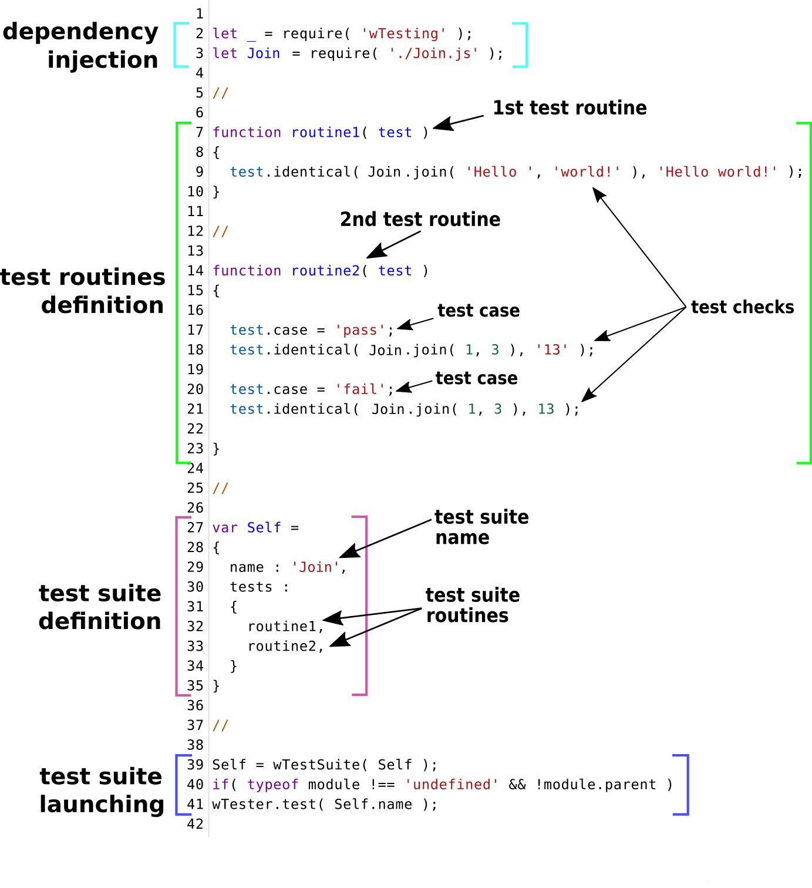

# Оформлення тест сюіта

Описано структуру тест сюіта, підхід в використанні елементів.

### Загальна структура тест сюіта

На прикладі файла [`Join.test.js`](./HelloWorld.md) показано структуру тест сюіта.

<details>
    <summary><u>Код файла <code>Join.test.js</code></u></summary>

```js
let _ = require( 'wTesting' );
let Join = require( './Join.js' );

//

function routine1( test )
{
  test.identical( Join.join( 'Hello ', 'world!' ), 'Hello world!' );
}

//

function routine2( test )
{

  test.case = 'pass';
  test.identical( Join.join( 1, 3 ), '13' );

  test.case = 'fail';
  test.identical( Join.join( 1, 3 ), 13 );

}

//

var Self =
{
  name : 'Join',
  tests :
  {
    routine1,
    routine2,
  }
}

//

Self = wTestSuite( Self );
if( typeof module !== 'undefined' && !module.parent )
wTester.test( Self.name );
```

</details>

Приведений вище код має мінімальний набір даних для демонстрації структурних одиниць. Секціонування файлу за функціональним призначенням приведено на рисунку нижче.

<details>
    <summary><u>Структура тест файла на прикладі <code>Join.test.js</code></u></summary>



</details>

Структура тестового файла складається з чотирьох елементів:
- підключення залежностей;
- визначення тест рутин;
- визначення тест сюіта;
- секція запуску тест сюіта.

### Секція підключення залежностей

Секція призначена для підключення в тест файл залежностей потрібних для тестування. Для здійснення тестування обов'язковою є утиліта `Testing`. Інші залежності, що підключаються в файл підключають тест юніт і створюють оточення для виконання тесту.

В даному файлі підключено утиліту `Testing` і файл `Join.js` з об'єктом тестування.

### Секція визначення тест рутин

Тест рутина - рутина ( функція, метод ) розроблена для тестування якогось із аспектів об'кту тестування. Тест рутина може включати:

- початкові дані, об'явлення контексту (за необхідності);
- [тест кейси](../concept/TestCase.md);
- [тест перевірки](../concept/TestCheck.md).

Розробник може помістити в секцію необхідну кількість тест рутин для тестування обраного об'єкту. Кожна з тест рутин може містити довільну кількість тест кейсів і тест перевірок.

#### Вибір назви тест рутини

Назва тест юніта і тест рутини мають співпадати. Це дозволяє зрозуміти який тест юніт тестується. Якщо покриття необхідно розділити на декілька тест рутин, їх назви повинні починатись з назви тест юніта і пояснювати суть тест рутини.

Назви рутини `routine1` i `routine2` є поганими по двом причинам. По перше, назва не вказує на тест юніт. що тестується. Тестується рутина `join`, відповідно назви тест рутин мають починатись на `join`. По друге, в назвах тест рутин містяться індекси 1 і 2, котрі не інформують розробника про предмет тестування.

Тест рутини в файлі `Join.js` можуть мати назви:

```
joinWithSingleCheck
joinWithFailedCheck
```

#### Тест кейси

Тест кейс - це одна або декілька тест перевірок із супровідним кодом поєднаних в логічну структурну одиницю для перевірки функціональності якогось аспекту об'єкту, що тестується.

Код тест кейсу в файлі `Join.test.s` має примітивну форму. Він складається з опису і тест перевірки. На практиці частіше зустрічаються тест кейси, що потребують об'явлення початкових даних і очікуваного результату тест кейсу.

<details>
    <summary><u>Приклад тест кейса з об'явленням змінних</u></summary>

```js
test.case = 'dst is empty array, ins is primitive';
var dst = [];
var ins = 'str';
var got = _.arrayAppend( dst, ins );
var expected = [ 'str' ];
test.identical( got, expected );
test.true( got === dst );
```

</details>

Використання змінних, в першу чергу, обумовлене потребами в якісному покритті. Приведений тест кейс показує, що рутина `arrayAppend` додає елемент `ins` в оригінальний `dst` масив, а не робить його копію. Також, використання змінних покращує сприйняття даних в тест кейсі за рахунок розділення на окремі складові.

#### Опис умов чи результату тест кейса

Опис тест кейсу чи тест перевірки має явно вказувати на те, що перевіряється, чи яким має бути результат перевірки.

В тест рутині `routine2` є 2 тест кейса з назвами `pass` i `fail`. З позиції позначення результату виконання дані тест кейси названі правильно.

<details>
    <summary><u>Приклад незрозумілого опису тест кейса</u></summary>

```js
test.case = 'null, null';
var got = _.arrayAppend( null, null );
var expected = [ null ];
test.identical( got, expected );
```

</details>

За задумкою приведений опис має вказувати на передані аргументи, проте такий опис в виводі тестера нічого не говорить про тест кейс.

<details>
    <summary><u>Приклад альтернативних назв тест кейса</u></summary>

```js
test.case = 'dst is null, ins is primitive';
```

```js
test.case = 'dst is null, primitive appends to new container';
```

</details>

Як безпосереднє вказання назв аргументів, так і позначення бажаного результату дозволяють зрозуміти концепцію тест сюіта.

### Як назвати тест кейс

Опис окремих тест кейсів має вказувати на відмінність між конкретним тест кейсом від інших.

Тест кейси `pass` i `fail` є протилежними результатами, що відразу зрозумілі.

Тест кейси можуть мати менші відмінності.

<details>
    <summary><u>Приклад опису тест кейсів з описом умов</u></summary>

```js
test.case = 'range[ 0 ] - 0, range[ 0 ] < range[ 1 ]';
// code of test case

test.case = 'range[ 0 ] - 0, range[ 0 ] === range[ 1 ]';
// code of test case
```

</details>

Тест кейси відносяться до однієї групи, різниця полягає в співвідношенні між двома елементами ренжа.

<details>
    <summary><u>Приклад тест кейса з об'явленням змінних</u></summary>

```js
test.case = 'expects empty array';
// code of test case

test.case = 'saves 2 elements from start';
// code of test case
```

</details>

Різниця між приведеними тест кейсами в тому, тому який масив очікується на виході рутини.

#### Тест перевірки

Тест перевірки - очікування розробника стосовно поведінки об'єкту, що тестується виражене якоюсь умовою. Це найнижча структурна одиниця тестування.

Для об'явлення окремої тест перевірки використовується поле `description`.

<details>
    <summary><u>Приклад іменованої тест перевірки</u></summary>

```js
test.description = 'not changed context routine';
test.identical( this.contextRoutine, onEach );
```

</details>

В виводі тестера дана тест перевірка буде мати спільну частину назви з тест кейсом, що йде попереду, і до цієї частини буде додано власна назва. Справа у тому, що при об'явленні нової тест перевірки лічильник тест кейсів не змінюється.

### Секція визначення тест сюіта

Секція призначенна для об'явлення тест сюіта - найвищої структурної одиниці тестування. Тест файл має містити лише один тест сюіт.

Для визначення тест сюіту він має містити назву і набір тест рутин.

Посилання на тест рутини поміщаються в секції `tests`. Порядок рутин в секції має відповідати порядку тест рутин в файлі. Це дозволяє швидко орієнтуватись в структурі файла і шукати потрібну тест рутину.

В об'явленні тест сюіта можуть міститись [додаткові опції](TestOptions.md), котрі керують процесом тестування. Також, в даній секції може міститись глобальний контекст виконання тест сюіту, спеціальні рутини, що виконуються перед початком тестування або після завершення тестування.

Згідно приведеного коду, файл `Join.test.js` містить тест сюіт `Join`. Тест сюіт має дві тест рутини. Тест сюіт не містить додаткових опцій.

<details>
    <summary><u>Приклад об'явлення тест сюіта з опціями і контекстом</u></summary>

```js
var Self =
{
  name : 'Join',
  silencing : 1,
  routineTimeOut : 30000,

  onSuiteBegin,
  onSuiteEnd,

  context :
  {
    assetFor
  },

  tests :
  {
    routine1,
    routine2,
  }
}
```

</details>

Приведена секція описує тест сюіт з назвою `Join`. Тест сюіт містить опції `silencing`, котра вимикає вивід об'єкту тестування, `routineTimeOut` - встановлює час на виконання окремої тест рутини. Поле `onSuiteBegin` вказує на спеціальну рутину, котра автоматично виконується перед запуском тестування тест рутин. Поле `onSuiteEnd` - відповідно на рутину, котра буде автоматично виконана після завершення тестування. Поле `context` визначає глобальний контекст тест сюіта. В даному випадку поле `context` містить посилання на рутину `assetFor`.

Для зручності глобальний контекст і спеціальні рутини поміщаються на початку тест сюіта, одразу після підключення залежностей.

Для доступу до даних контексту в тест рутині використовується ключове слово `this`.

<details>
    <summary><u>Приклад використання рутини контексту</u></summary>

```js
function testRoutine( test )
{
  var asset = this.assetFor( test, 'testRoutine' );

  // code of test routine
}
```

</details>

Змінній `asset` призначено результат виконання рутини `assetFor` контексту.

### Cекція запуску тест сюіта

Рядки 39-41 містять функції для запуску тестування.
В 39-ому рядку відбувається створення тест сюіта. А в рядках 40-41 відбувається його запуск. Без рядків 40-41 тест файл буде неможливо запустити напряму: `node ./Join.test.js`.

### Підсумок

- Для зручності управління процесом тестування кожен тест сюіт має знаходитися у окремому файлі.
- Тест файл складається з чотирьох основних частин: підключення залежностей, визначення тест рутин, визначення тест сюіта, запуск тест сюіта.
- Основний код тест сюіта поміщається в секції тест рутин.
- Розробник визначає потрібну кількість тест рутин, тест кейсів і тест перевірок.
- Назва тест рутини має вказувати на об'єкт та умови тестування.
- Кожна тест рутина складається з тест кейсів і тест перевірок. Назви тест кейсів та тест перевірок вказують як на зміст тестового випадку так і на відмінність від інших.
- Окремо об'явлена тест перевірка включається в тест кейс, що йде попереду, таку перевірку можна виділити використавши поле `description`.
- Об'явлення тест сюіту має містити назву і набір тест рутин. Додатково можуть бути об'явлені опції тестування, контекст і рутини для підготовки і завершення виконання тест сюіта.

[Повернутись до змісту](../README.md#Туторіали)
