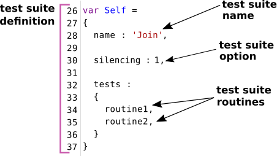

# Огляд структурних одиниць

Загальний опис структурних одиниць тест сюіта.

### Тест сюіт

Тест сюіт ( тестовий комлект, тестовий набір ) - це набір тест рутин, та тестових данних для тестування об'єкту тестування.

Тест сюіт міститься в окремо відведеному під нього файлі. Тест сюіт складається із:

- тест рутин;
- опцій тестування;
- даних до нього

#### Визначення тест сюіта в файлі

На рисунку приведена секція коду з визначенням тест сюіта. Тест сюіт має назву `Join` і має [опцію](../tutorial/TestOptions.md) `silencing`. При виконанні тест сюіта спочатку буде проведено тестування в рутині `routine1`, а потім в `routine2`.

### Тест рутина

Тест рутина - рутина ( функція, метод ) розроблена для тестування, якогось із аспектів об'кту тестування. Тест сюіт розбивається на тест рутини, кожна із котрих виконується незалежно одна від одної. Інструкції тест рутини виконується послідовно та містять в собі тест перевірки, котрі можуть об'єднуватися в тест кейси та можуть мати опис.

Розбиття тест сюіта на тест рутини потрібно проводити з урахуванням того, що рутина припиняє своє виконання при першій же викинутій помилці.

#### Приклад тест рутин

На рисунку приведено секцію коду з двома визначеними тест рутинами. Перша рутина з назвою `routine1` виконує одну тест перевірку на ідентичність двох значень. Друга тест рутина з назвою `routine2` має два тест кейси, в кожному з яких є по одній тест перевірці. Окрім цього, друга тест рутина містить в своєму тілі опис тест кейсів. Для виконання тест рутин їх потрібно не забути згадати в визначенні тест сюіта.

### Тест кейс

Тест кейс або група тест перевірок - це одна або декілька тест перевірок із супровідним кодом поєднаних в логічну структурну одиницю для перевірки функціональності якогось аспекту об'єкту, що тестується.

#### Визначення через `test.case`

Застосовуйте поле `test.case` для визначення тест кейсів.

Тест рутина `routine1` має тест кейси `trivial` i `empty`. Визначення тест кейсу відбувається присвоєнням рядкового значення полю `case`. Початок наступного тест кейсу закриває попередній - тест кейс `empty`, котрий відкрито в 27 рядку, закрив тест кейс `trivial`.

#### Визначення через `test.open()`, `test.close()`

Застосовуйте рутини `test.open()`, `test.close()` для групування перевірок.

Тест рутина `routine2` має таку ж структуру, як із тест рутина `routine1`. Вона має тест кейси `trivial` i `empty`. Для того, щоб задати тест кейс використовується рутина `test.open()`, якій а якості аргумента передається назва тест кейса. Закривається тест кейс рутиною `test.close()`. Рутина `test.close()` так само, як і рутина `test.open()` приймає назву тест кейсу.

Тестова рутина `routine3` має 2-ві групи перевірок `string` та `number`. Їх було так згруповано по типу аргументів, що передаються функції, що тестується `Join.join`. Групу `string` описано рядками 22-30, групу `number` описано рядками 31-39. Групу `string` містить 2-ва тест кейси `trivial` та `empty` в кожному із яких по одній перевірці. Група `number` має тест кейси `trivial` та `zeroes` із одною перевіркою в кожному. Звіт, що формується на основі такої структури тест рутини можна бачити в туторіалі про те [як читати звіт](Report.md).

Структура тест рутини може бути складною і мати безліч рівнів вкладеності.

### Тест перевірка

Тест перевірка - очікування розробника стосовно поведінки об'єкту, що тестується виражене якоюсь умовою. Це найнижча структурна одиниця тестування.

Більшість перевірок приймаю два аргументи і порівнюючи їх видають позитивний або негативний результат тестування:

- отримані дані
- очікувані дані

[Тест кейс](TestCase.md) складається із одної або декількох перевірок. Достатньо лише однієї перевірки із результатом `failed` щоб увесь об'єкт, що тестується вважався таким, що не пройшов тестування.

#### Приклад тест кейса з перевірками

На рисунку зображено тест кейс `join strings` з трьома тест перевірками. Кожна з перевірок порівнює два значення. Перше отримане з допомогою методу `join`, а друге, очікуване значення, задане розробником.

#### Перелік тест перевірок

- `true`;
- `false`;
- `identical`;
- `notIdentical`;
- `equivalent`;
- `notEquivalent`;
- `contains`;
- `gt`;
- `ge`;
- `lt`;
- `le`;
- `mustNotThrowError`;
- `shouldReturnSingleResource`.
- `shouldThrowErrorSync`;
- `shouldThrowErrorAsync`;
- `shouldThrowErrorOfAnyKind`.

Призначення і використання тест перевірок описані в концепції [`Тест перевірка`](../concept/TestCheck.md)

### Підсумок

- Тест сюіт складається з тест рутин, опцій тестування і тестових даних.
- Тест сюіт розміщується в окремому тест файлі, він визначається окремою секцією.
- Тест рутини проводять тестування об'єкту тестування.
- Тест кейси групують декілька тест перевірок для тестування певного тестового випадку.

[Повернутись до змісту](../README.md#Туторіали)
